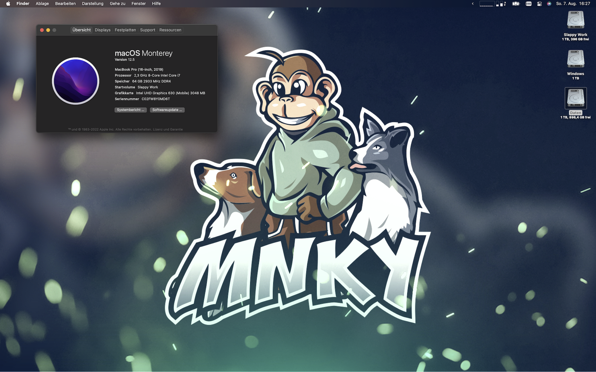
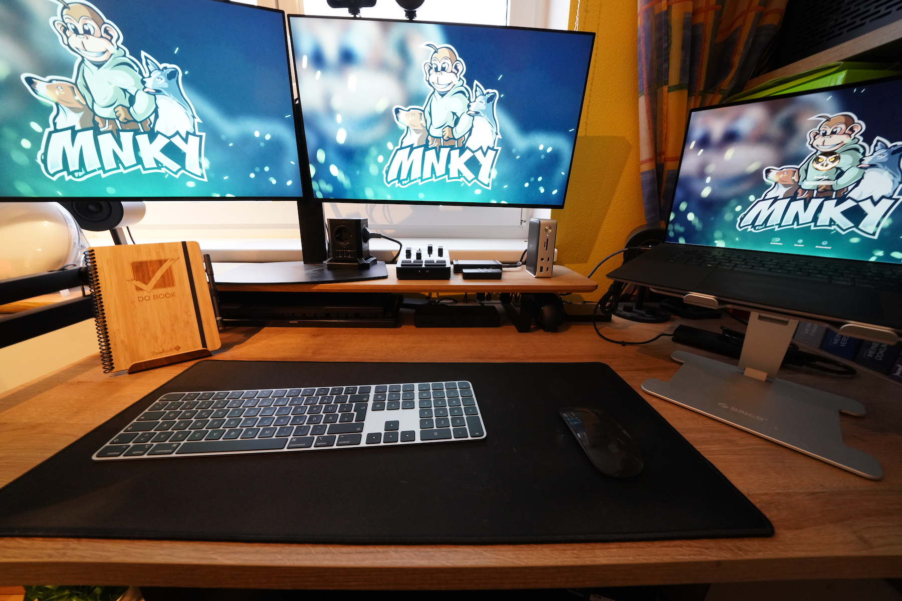
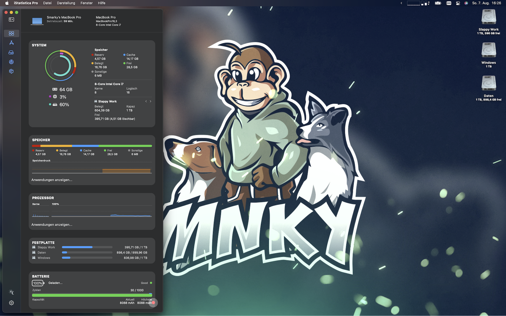

# Dell XPS 9700 17" macOS Monterey

✅ This configuration is fully compatible with `macOS Monterey`.\
⏳ The latest supported and tested version is: `macOS Monterey 12.5`.\
😔 Two of the most awesome features of this laptop don't **yet** work: S3 sleep and audio. If you want to help, contact me!

## Table of Contents

* [Hardware](#hardware)
  * [Current State](#current-state)
* [BIOS](#bios)

## Hardware

### Current State

This is what I'm currently running on (check against yours, or your mileage may vary):

| Part | Description | Working on macOS | Comment | Working on Linux |
| ---- | ----------- | ---------------- | ------- | ---------------- |
| **Working** |
| Intel Core i7-10875H CPU @ 2.30GHz | 8C/16T CometLake Processor, UHD-630 | yes, fully | / | yes, fully |
| Display | Dell XPS 17 SHP14D6 4K 16:10 | yes, fully | / | yes, fully |
| Kingston Fury DDR4-2933 MHz 2x32GB | 64GB of CL17-19-19 | yes, fully | / | yes, fully |
| Samsung SSD 970 EVO Plus 2TB Media | M.2 Gen3 SSD, Slot A | yes, fully | Used for macOS + shared HFS+ Drive | yes, with Paragon HFS+ driver |
| Samsung SSD 970 EVO Plus 2TB Media | M.2 Gen3 SSD, Slot B | yes, fully | Used for Windows + Manjaro Linux | yes, fully (Manjaro), with Paragon NTFS driver (Windows) |
| Killer AX1650s | WiFi 6 & BT 5 Card | yes, pretty good | soldered in | yes, fully |
| Touchpad | DELL098F:0004F3:311C, I2C | yes, fully | all gestures operational | yes, fully |
| Keyboard | Standard PS2 | yes, fully | function keys are mapped | yes, fully |
| Touch-Digitizer | ELAN2097:0004F3:2A15, I2C | yes, fully | all native gestures operational | yes, fully |
| Webcam | Micromedia 0c45:6d14, 0.9MP | yes, fully | / | yes, fully |
| Battery | DELL 01RR3YM Li-poly 95.1Wh | yes, fully | / | yes, fully |
| Sensors | Intel 8086:06fc:1028:098f 400 Series Sensor Hub | yes | Fans & Temps | yes, fully |
| USB-C Video 4K@60Hz | / | yes, fully | / | yes, fully |
| **Untested** |
| Thunderbolt 3 | Intel JHL7540, JHL6540 | haven't tested TB3 peripherals yet | / | not yet tested |
| External Monitor Audio | / | not yet tested | / | not yet tested |
| Gigabit Ethernet | Realtek RTL8153 | not yet tested | / | not yet tested |
| **Currently Not Working** |
| SD-Card reader | Realtek RTS5260 | no | can't seem to get it working with any kexts | yes, fully |
| Speakers & Jack | / | no | Codec currently unknown, it's tough | yes, fully |
| Ambient Light Sensor | / | no | _ALI only responds 0x0 | yes, fully |
| S3 sleep state | Deepest possible sleep state | no | panics on wake | yes, fully |
| **Dead forever** |
| Nvidia RTX 2060 Max-Q | 6GB DDR6 VRAM | no | deactivated using SSDT | yes |
| Fingerprint reader | Shenzhen Goodix 27c6:533c | no | / | no |

## BIOS

I am on the currently (date: 11th Dec, 2021) latest available BIOS, which I installed using windows updates. It then flashed the firmware onto my device on a reboot. The exact version is: 1.11.1 11/18/2021. In order to have no complications, make sure you change these BIOS settings:

| Menu | Setting | State |
| ---- | ------- | ----- |
| Boot Configuration | Enable Secure Boot | Off |
| Pre-boot Behavior | Fastboot | Thorough |
| Integrated Devices | Thunderbolt Security Level | No Security |
| Storage | Sata Operation | AHCI |
| Power | Enable Lid Switch | On |
| Security | Intel Software Guard Extensions | Software Control |
| Power | Block Sleep | On |

Blocking sleep is just a bypass for now, I hope there's a fix down the road. I'll keep an eye on the topic.
